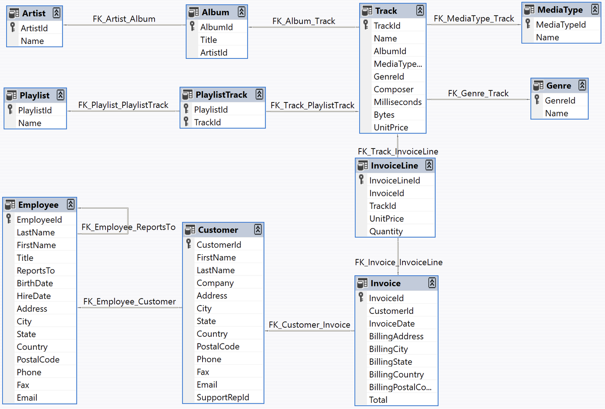
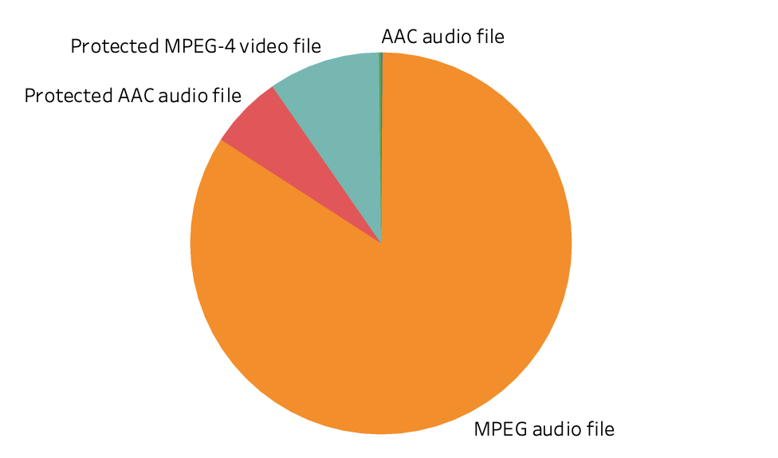
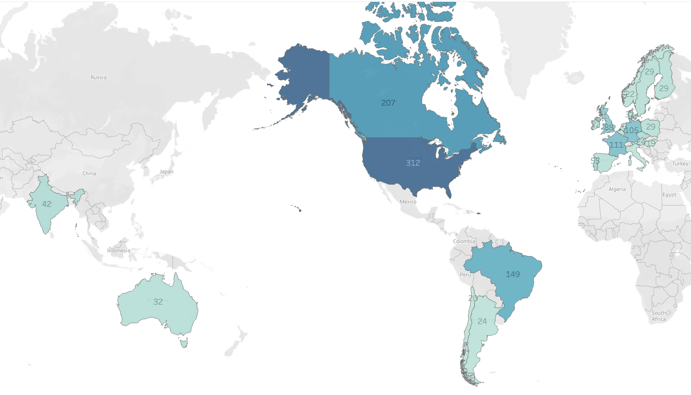
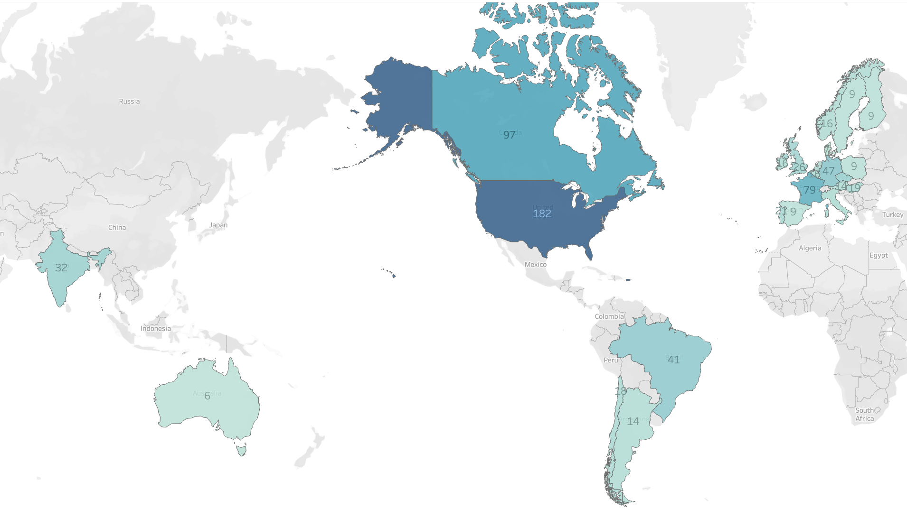

# iTunes-Library-Revenue-Genre-Visualization
# Project Overview
This project explores iTuens sales data to uncover key trends in revenue, genre popularity, and media type distribution. The insights from this analysis can help businesses to understand consumer preferences, optimize inventory and enhance marketing strategies. 

# Data Structure
Data model represents a digital media store, including tables for artists, albums, media tracks, invoices and customers. Data was generated using real data from an iTunes Library. 

  

*Imported from https://github.com/lerocha/chinook-database*

# Key Insights
### Media Type Popularity ###

MPEG audio file  account for the majority of revenue, while AAV audio file and MPEG vido file remain niche markets.
Need to consider phasing out low-performing formats (e.g., AAC and MPEG video) or bundling them with top-performing media to boost sales.

  

### Genre Popularity ###
**Revenue by Genre**

  

**Genre Popularity by Country**
Top 3 Genres - Rock, Latin, Metal

  

**The Rest**

  

The analysis reveals that genres like Rock, Metal and Latin contribute significantly to revenue. Could consider increasing inventory and marketing efforts for high-revenue genres and exploring cross-selling opportunities by recommending popular genres alongside niche genres.

# Getting Started
1. Clone the Repository: Clone this repository to your local machine using git clone https://github.com/statington/iTunes-Library-Revenue-Genre-Visualization.git.
2. Data Exploration: The SQL script iTunes.sql contains the database schema and data. Use a SQL-compatible database management system to explore the data.
3. Visualizations: The Tableau workbook iTunes Library Visuals.twbx includes all visualizations. Open this file with Tableau to interact with the visualizations.
